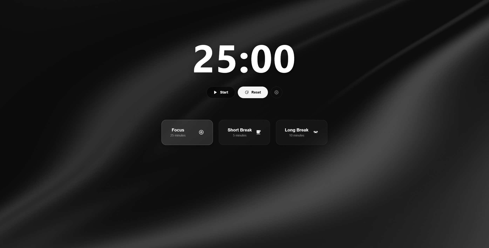

# Pomodoro Timer — Inspired by Vercel

Un temporitzador Pomodoro d'alta gamma amb una estètica minimalista i moderna, inspirada en el llenguatge de disseny de Vercel. Creat per optimitzar la productivitat amb una experiència d'usuari fluida i elegant.

 
*Disseny premium amb efectes de transparència i fons dinàmics.*

## ✨ Features

- **Premium Design:** Interfície "Glassmorphism" amb fons dinàmics i textures de quadrícula.
- **Custom Logic:** Temporitzador precís basat en `Date.now()` per evitar desviaments de temps i assegurar exactitud mil·limètrica.
- **Persistence:** Desa la teva configuració personalitzada (temps de focus, descansos, cicles) al `localStorage` del navegador.
- **Audio Feedback:** Alerta sonora integrada per avisar de la finalització de cada sessió de treball o descans.
- **Responsive:** Disseny totalment adaptat a dispositius mòbils, tablets i escriptori.
- **Keyboard Shortcuts:** Controla el flux de treball ràpidament amb la barra d'espai (Play/Pause) i la tecla 'R' (Reset).

## 🛠️ Technologies

- **React** (Vite)
- **CSS3 Modern** (Variables, Flexbox, Grid, Glassmorphism)
- **Custom Hooks** (Lògica de temporització totalment encapsulada)

## 🚀 Installation & Setup

Si vols executar aquest projecte localment al teu ordinador, segueix aquests passos:

1. **Clona el repositori:**
   ```bash
   git clone [https://github.com/KillianTR/Pomodoro-Timer.git](https://github.com/KillianTR/Pomodoro-Timer.git)
